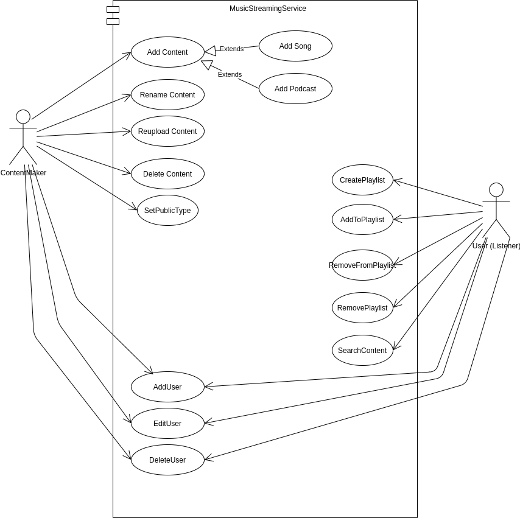
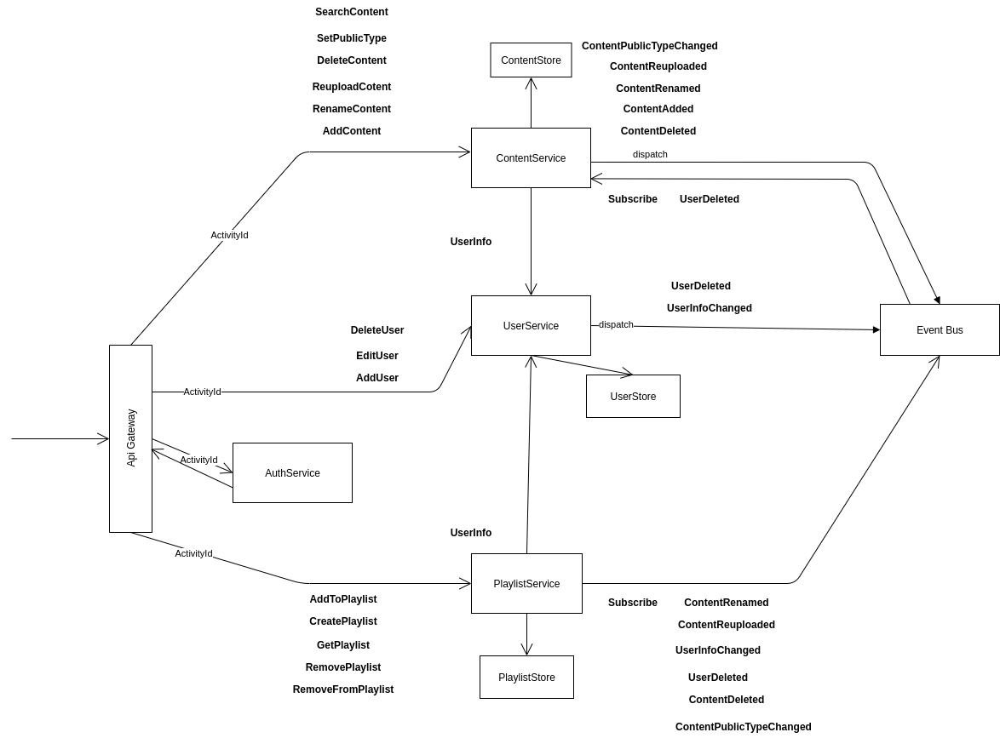
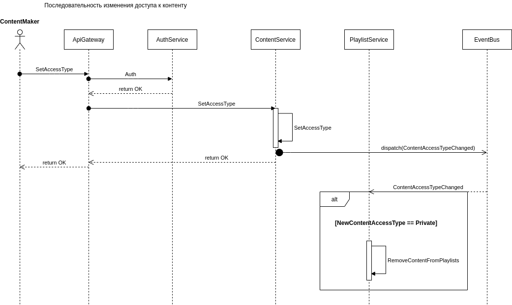
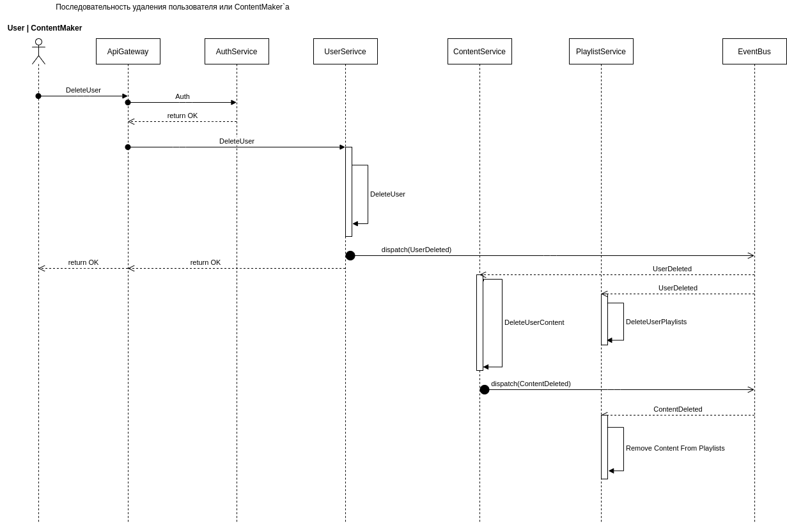

# Music Streaming Service

## Идея
Сервис позволяющий загружать контент (песни, подкасты), создавать плейлисты и добавлять в плейлисты музыку и подкасты  
В модели есть понятие пользователь и создатель контента(ContentMaker). ContentMaker тот же самый пользователь, только у него есть возможность создавать контент

[Оригинал диаграмм](https://drive.google.com/drive/folders/1TCwzjnvnvKQ2g8pzUVq1ox6fchF_cI8x?usp=sharing)
## Use Case

## Диаграмма сервисов

## Диаграмма последовательностей

### Переименование контента

### Удаление пользователя
